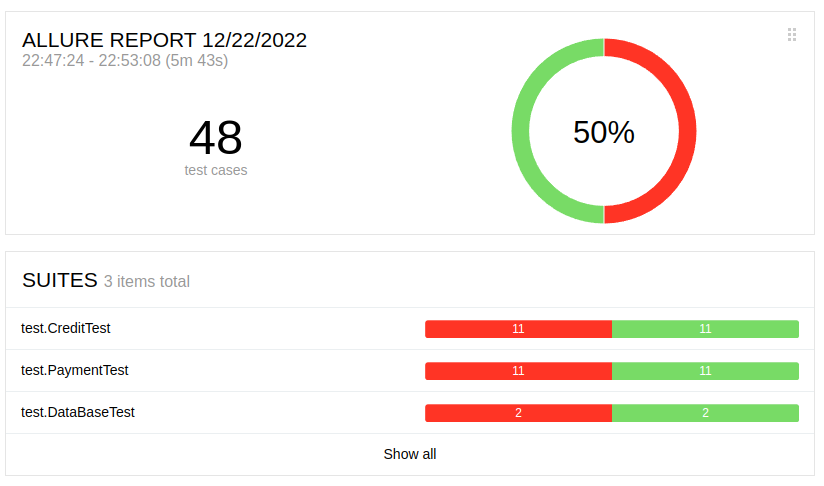
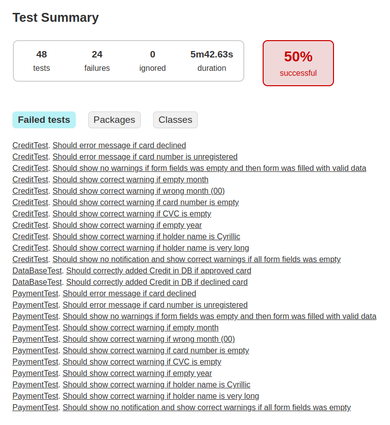

## Отчёт о проведённом тестировании
### Краткое описание
Проведена автоматизация тестирования сервиса покупки тура, который предлагает купить тур двумя способами:
1. Обычная оплата по дебетовой карте.
2. Выдача кредита по данным банковской карты.
### Количество тест-кейсов
Автоматизировано 48 тест-кейсов для каждой из СУБД (MySQL и PostgreSQL).
### Процент успешных и не успешных тест-кейсов
При проведении тестирования на обеих СУБД результат: 
50% - успешных тестов, 
50% - тестов, выявивших дефект. 
Выявленные дефекты оформлены в виде issue.  
**MySQL**: 
 
 **PostgreSQL**: 
 

### Общие рекомендации
1. На проекте выявлен недостаток документации:
* Необходимо создать документацию, описывающую функциональность сервиса. Без этого тестирование может быть неточным. Например, должны ли попадать в БД операции по заблокированным картам? С какой целью? Может быть в Базе данных должны отображаться и данные по другим операциям? Например, при покупке по карте с незарегистрированным номером или по карте с истекшим сроком? 
* Необходимо описание пользовательского интерфейса. Название "Марракэш" намекает на начисление процентов на остаток по счету или это опечатка? Клавиша "Купить в кредит" выделена цветом - дефект или маркетинговый ход для повышения продаж кредитования?
2. Большинство выявленных дефектов связаны с неточным отображением текста предупреждений при проверке значений введенных в поле. Необходимо провести мониторинг алгоритма отображения текста предупреждений.
3. Элементы страницы, необходимые для автоматизации тестирования, не имеют уникальных привязок-идентификаторов. Их внедрение позволит повысить стабильность работы автотестов.  